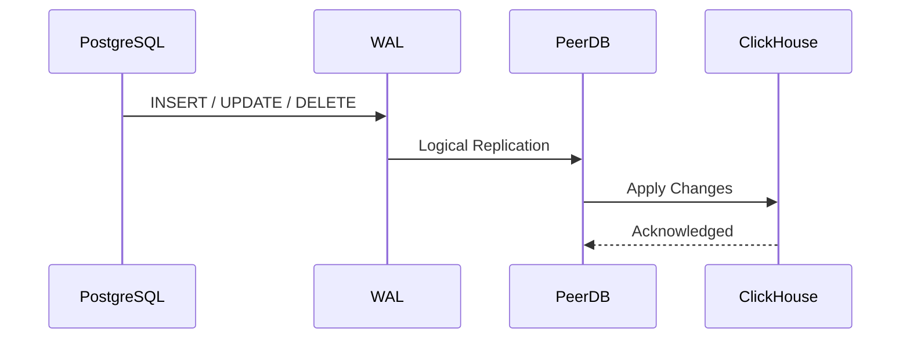

```mermaid
sequenceDiagram

participant PG as PostgreSQL

participant WAL as WAL

participant P as PeerDB

participant CH as ClickHouse

PG->>WAL: INSERT / UPDATE / DELETE

WAL->>P: Logical Replication

P->>CH: Apply Changes

CH-->>P: Acknowledged
```
