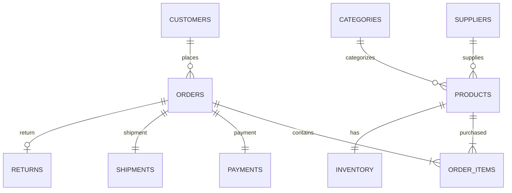

```mermaid
erDiagram

CUSTOMERS ||--o{ ORDERS : places

ORDERS ||--|{ ORDER_ITEMS : contains

PRODUCTS ||--|{ ORDER_ITEMS : purchased

PRODUCTS ||--|| INVENTORY : has

SUPPLIERS ||--o{ PRODUCTS : supplies

CATEGORIES ||--o{ PRODUCTS : categorizes

ORDERS ||--|| PAYMENTS : payment

ORDERS ||--|| SHIPMENTS : shipment

ORDERS ||--o| RETURNS : return
```
