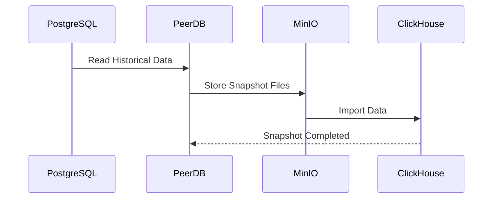

```mermaid
sequenceDiagram

participant PG as PostgreSQL

participant P as PeerDB

participant M as MinIO

participant CH as ClickHouse

PG->>P: Read Historical Data

P->>M: Store Snapshot Files

M->>CH: Import Data

CH-->>P: Snapshot Completed
```
